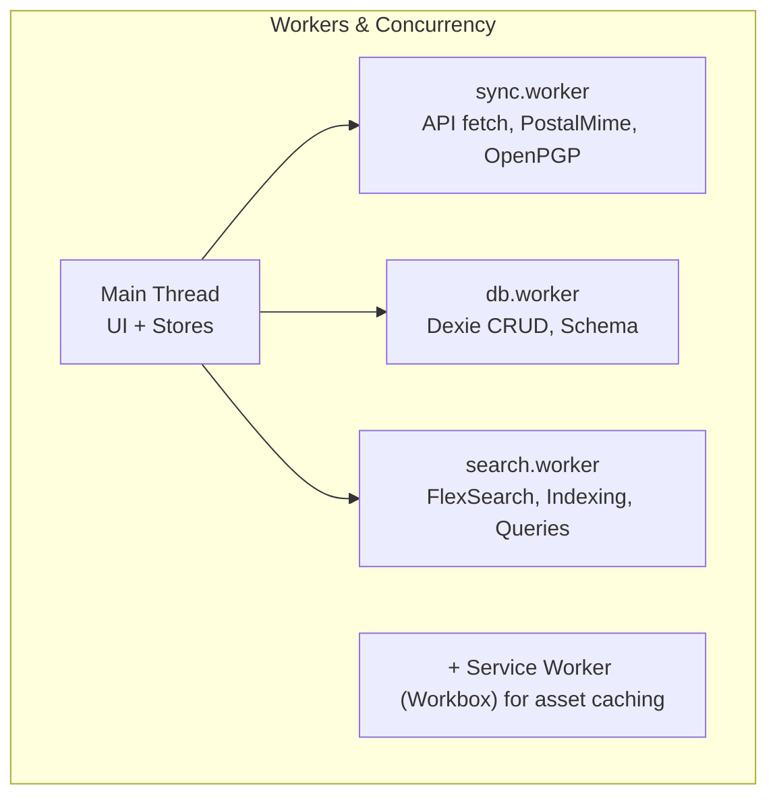

# Building Webmail: Technology Stack

Every tool in this stack was chosen to serve one goal: a static, client-only
webmail app that behaves like a native client.

## Stack Principles


## Core Platform


| Layer       | Tool         | Version           | Why                                                                        |
| ----------- | ------------ | ----------------- | -------------------------------------------------------------------------- |
| Framework   | Svelte       | ^5.48             | Runes (`$state`, `$derived`, `$effect`), compiled reactivity, tiny runtime |
| Build       | Vite         | ^5.0              | Sub-second HMR, optimized chunking, ES modules                             |
| PWA         | Workbox      | ^7.0              | Reliable precaching, SPA fallback, cache-first                             |
| Styling     | Tailwind CSS | ^4.1              | Utility-first, purged in production                                        |
| Components  | shadcn/ui    | via Bits UI ^2.15 | Accessible, composable primitives                                          |
| TypeScript  | TypeScript   | ^5.3              | Strict mode, worker typing                                                 |
| Package Mgr | pnpm         | ^9.0              | Fast, disk-efficient, strict                                               |
| Node        | Node.js      | 20 LTS            | Stable, long-term support                                                  |

## Data & Storage


| Component     | Tool       | Version | Why                                                    |
| ------------- | ---------- | ------- | ------------------------------------------------------ |
| Database      | Dexie      | ^4.2    | Schema layer over IndexedDB, compound keys, migrations |
| Search        | FlexSearch | ^0.7    | Fast client-side full-text, persistent indexes         |
| HTTP Client   | ky         | ^1.14   | Lightweight, retry-aware, hooks                        |
| Email Parsing | PostalMime | ^2.6    | RFC-compliant MIME parsing in workers                  |

## Workers & Concurrency



Every worker communicates via `MessageChannel` — no shared memory, no
contention, no UI stalls.

## Composition & Content

| Component        | Tool                 | Version | Why                                       |
| ---------------- | -------------------- | ------- | ----------------------------------------- |
| Rich Text Editor | TipTap               | ^2.6    | Extensible, ProseMirror-based, formatting |
| Calendar         | Schedule-X           | ^1.63   | Month/week/day views, no server rendering |
| Sanitizer        | DOMPurify            | ^3.1    | XSS protection for HTML email content     |
| Encryption       | OpenPGP              | ^6.2    | Client-side PGP decrypt/encrypt           |
| Markdown         | marked               | ^12.0   | Compose in markdown, render as HTML       |
| Emoji            | emoji-picker-element | ^1.21   | Native emoji selection                    |
| Icons            | Lucide Svelte        | ^0.562  | Tree-shakeable SVG icon library           |
| Dates            | date-fns             | ^3.6    | Lightweight date formatting/parsing       |

## Security & Privacy


## Build & Quality

| Tool                     | Purpose                                 |
| ------------------------ | --------------------------------------- |
| ESLint 9 + TypeScript    | Linting with strict rules               |
| Prettier 3               | Consistent formatting                   |
| Husky + lint-staged      | Pre-commit quality gates                |
| Vitest 2.1               | Unit tests (jsdom)                      |
| Playwright 1.57          | E2E browser tests                       |
| Lighthouse CI            | Performance, a11y, best practices (90+) |
| rollup-plugin-visualizer | Bundle analysis (`pnpm analyze`)        |

## Build-Time Environment Variables

Vite statically replaces these values at build time via the `define` option in
`vite.config.js`. Every occurrence in source code is swapped with the literal
string during compilation — they do not exist at runtime as real environment
variables.

| Variable                                | Source                                | Example Value                  | Purpose                                          |
| --------------------------------------- | ------------------------------------- | ------------------------------ | ------------------------------------------------ |
| `import.meta.env.VITE_PKG_VERSION`      | `package.json` → `version`            | `0.0.1`                        | Semantic version used for clear-site-data checks |
| `import.meta.env.VITE_APP_VERSION`      | `${pkg.version}-${BUILD_HASH}`        | `0.0.1-a1b2c3d4`               | Full version with build hash for cache busting   |
| `import.meta.env.VITE_BUILD_HASH`       | MD5 of `${pkg.version}-${Date.now()}` | `a1b2c3d4`                     | Unique per-build identifier                      |
| `import.meta.env.VITE_WEBMAIL_API_BASE` | `.env` or CI environment              | `https://api.forwardemail.net` | API base URL (set externally, not in `define`)   |

### How it works

```js
// vite.config.js
const pkg = require('./package.json');
const BUILD_HASH = createHash('md5')
  .update(`${pkg.version}-${Date.now()}`)
  .digest('hex')
  .slice(0, 8);

export default defineConfig({
  define: {
    'import.meta.env.VITE_APP_VERSION': JSON.stringify(`${pkg.version}-${BUILD_HASH}`),
    'import.meta.env.VITE_BUILD_HASH': JSON.stringify(BUILD_HASH),
    'import.meta.env.VITE_PKG_VERSION': JSON.stringify(pkg.version),
  },
});
```

At build time, Vite replaces source references like:

```js
// Source
const version = import.meta.env.VITE_PKG_VERSION;

// After build
const version = '0.0.1';
```

### Where they're used

- **`VITE_PKG_VERSION`** — Boot-time version check in `src/main.ts` compares
  against a server-side `clear_below` threshold to trigger cache clearing
  (see [clear-site-data-spec](clear-site-data-spec.md)). Also displayed in
  Settings and sent with feedback reports.
- **`VITE_APP_VERSION`** — Full version identifier for cache busting and
  diagnostics.
- **`VITE_BUILD_HASH`** — Unique build fingerprint for tracking deployments.

### TypeScript support

Build-time variables are typed in `src/env.d.ts`:

```ts
interface ImportMetaEnv {
  readonly VITE_PKG_VERSION: string;
  readonly VITE_APP_VERSION: string;
  readonly VITE_BUILD_HASH: string;
}
```

## Performance Budget


## Development Commands

```bash
pnpm dev              # Dev server on :5174 with HMR
pnpm build            # Production build + SW generation
pnpm preview          # Preview production build
pnpm check            # Svelte type checking
pnpm analyze          # Bundle visualization → dist/stats.html

pnpm test             # Unit tests (Vitest)
pnpm test:watch       # Watch mode
pnpm test:coverage    # Coverage report
pnpm test:e2e         # E2E tests (Playwright)

pnpm lint             # ESLint check
pnpm lint:fix         # ESLint auto-fix
pnpm format           # Prettier check
pnpm format:fix       # Prettier auto-fix
```

---

**Next:** [Worker Mesh](building-webmail-workers.md) — the three-worker
architecture that keeps the UI at 60fps.
