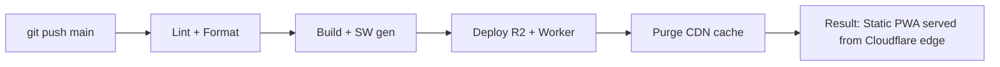
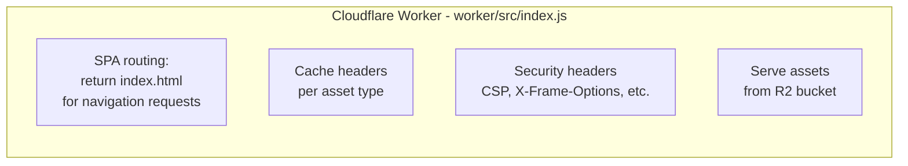
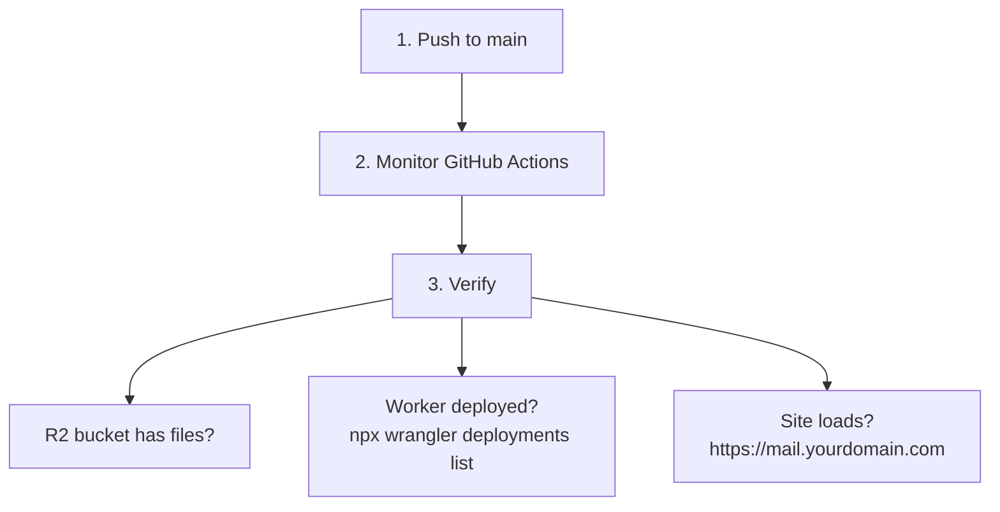
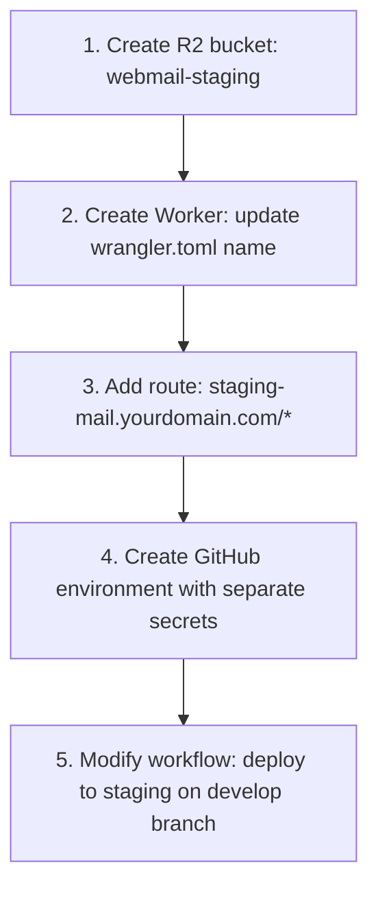

# Deployment Checklist

Complete setup guide for deploying the webmail app from scratch using Cloudflare
(R2 + Workers) and GitHub Actions.



## Prerequisites

- Cloudflare account with a domain configured
- GitHub repository with Actions enabled
- Node.js 20+ and pnpm 9+ installed locally

---

## 1. Cloudflare Setup

### 1.1 Create R2 Bucket

```
 Cloudflare Dashboard → R2 Object Storage → Create bucket
```

| Setting  | Value          |
| -------- | -------------- |
| Name     | `webmail-prod` |
| Location | Default        |

### 1.2 Create R2 API Token

```
 R2 → Manage R2 API Tokens → Create API token
```

| Setting      | Value                 |
| ------------ | --------------------- |
| Token name   | `webmail-deploy`      |
| Permissions  | Object Read & Write   |
| Bucket scope | Your bucket           |
| TTL          | No expiry (for CI/CD) |

Save these credentials:

| Credential        | Secret Name          |
| ----------------- | -------------------- |
| Access Key ID     | R2_ACCESS_KEY_ID     |
| Secret Access Key | R2_SECRET_ACCESS_KEY |

### 1.3 Get Account and Zone IDs

```
 Cloudflare Dashboard → Any domain → Overview → Right sidebar
```

| ID         | Secret Name        |
| ---------- | ------------------ |
| Account ID | R2_ACCOUNT_ID      |
| Zone ID    | CLOUDFLARE_ZONE_ID |

### 1.4 Create Cloudflare API Token

```
 My Profile → API Tokens → Create Token → Custom token
```

| Permission                   | Access |
| ---------------------------- | ------ |
| Account / Workers Scripts    | Edit   |
| Account / Workers R2 Storage | Edit   |
| Zone / Cache Purge           | Purge  |
| Zone / Workers Routes        | Edit   |

- **Zone Resources:** Include → Specific zone → Your domain
- **Account Resources:** Include → Your account
- Save the token → `CLOUDFLARE_API_TOKEN`

---

## 2. GitHub Repository Setup

### 2.1 Secrets

```
 Settings → Secrets and variables → Actions → Secrets
```

| Secret                 | Source   | Description                 |
| ---------------------- | -------- | --------------------------- |
| `R2_ACCESS_KEY_ID`     | Step 1.2 | R2 API access key           |
| `R2_SECRET_ACCESS_KEY` | Step 1.2 | R2 API secret key           |
| `R2_ACCOUNT_ID`        | Step 1.3 | Cloudflare account ID       |
| `CLOUDFLARE_API_TOKEN` | Step 1.4 | API token for Workers/cache |
| `CLOUDFLARE_ZONE_ID`   | Step 1.3 | Zone ID for cache purge     |

### 2.2 Variables

```
 Settings → Secrets and variables → Actions → Variables
```

| Variable    | Value          | Description    |
| ----------- | -------------- | -------------- |
| `R2_BUCKET` | `webmail-prod` | R2 bucket name |

---

## 3. Worker Configuration

### 3.1 wrangler.toml

```toml
name = "webmail-cdn"
main = "src/index.js"
compatibility_date = "2024-01-01"

routes = [
  { pattern = "mail.yourdomain.com/*", zone_name = "yourdomain.com" }
]

[[r2_buckets]]
binding = "BUCKET"
bucket_name = "webmail-prod"   # Updated by CI/CD
```

### 3.2 Worker Responsibilities



---

## 4. DNS Configuration

```
 Your Domain → DNS → Add record
```

| Type | Name   | Content     | Proxy   |
| ---- | ------ | ----------- | ------- |
| `A`  | `mail` | `192.0.2.1` | Proxied |

Traffic routes through the Worker — the A record is a placeholder.

---

## 5. Environment Variables

### Build-time

```bash
# .env or CI environment
VITE_WEBMAIL_API_BASE=https://api.forwardemail.net
```

The following variables are injected automatically by `vite.config.js` at build
time via the `define` option (no manual configuration needed):

| Variable           | Source            | Purpose                                 |
| ------------------ | ----------------- | --------------------------------------- |
| `VITE_PKG_VERSION` | `package.json`    | Semver for clear-site-data version gate |
| `VITE_APP_VERSION` | `version + hash`  | Full version for cache busting          |
| `VITE_BUILD_HASH`  | MD5 of version+ts | Unique per-build fingerprint            |

See [Technology Stack — Build-Time Environment Variables](building-webmail-technology-stack.md#build-time-environment-variables) for details.

### Runtime

None needed — the app is entirely client-side after build.

---

## 6. CI/CD Pipeline

```yaml
# .github/workflows/ci.yml
name: CI

on:
  push:
    branches: [main]
  pull_request:

env:
  NODE_VERSION: '20'
  R2_BUCKET: ${{ vars.R2_BUCKET }}

jobs:
  build-test-deploy:
    runs-on: ubuntu-latest
    steps:
      # ... checkout, setup pnpm, install deps ...

      - name: Lint + Format
        run: pnpm lint && pnpm format

      - name: Build
        run: pnpm build

      - name: Deploy to R2
        if: github.ref == 'refs/heads/main'
        env:
          AWS_ACCESS_KEY_ID: ${{ secrets.R2_ACCESS_KEY_ID }}
          AWS_SECRET_ACCESS_KEY: ${{ secrets.R2_SECRET_ACCESS_KEY }}
          R2_ACCOUNT_ID: ${{ secrets.R2_ACCOUNT_ID }}
        run: |
          ENDPOINT="https://${R2_ACCOUNT_ID}.r2.cloudflarestorage.com"
          aws --endpoint-url "$ENDPOINT" s3 sync dist/ "s3://${R2_BUCKET}/" --delete

      - name: Deploy Worker
        if: github.ref == 'refs/heads/main'
        env:
          CLOUDFLARE_API_TOKEN: ${{ secrets.CLOUDFLARE_API_TOKEN }}
          CLOUDFLARE_ACCOUNT_ID: ${{ secrets.R2_ACCOUNT_ID }}
        run: |
          sed -i "s/bucket_name = \".*\"/bucket_name = \"${R2_BUCKET}\"/" worker/wrangler.toml
          cd worker && pnpm install && npx wrangler deploy

      - name: Purge CDN Cache
        if: github.ref == 'refs/heads/main'
        env:
          CLOUDFLARE_ZONE_ID: ${{ secrets.CLOUDFLARE_ZONE_ID }}
          CLOUDFLARE_API_TOKEN: ${{ secrets.CLOUDFLARE_API_TOKEN }}
        run: |
          curl -X POST "https://api.cloudflare.com/client/v4/zones/${CLOUDFLARE_ZONE_ID}/purge_cache" \
            -H "Authorization: Bearer ${CLOUDFLARE_API_TOKEN}" \
            -H "Content-Type: application/json" \
            --data '{"purge_everything":true}'
```

---

## 7. First Deployment



---

## 8. Post-Deployment Verification

### Functional Checks

- [ ] App loads at https://mail.yourdomain.com
- [ ] Login works
- [ ] Can view mailbox
- [ ] Can compose and send email
- [ ] Can view calendar
- [ ] Service worker registers (DevTools → Application)

### Performance Checks

- [ ] Assets cached (check Cache-Control headers)
- [ ] Lighthouse score > 90
- [ ] No console errors

### Security Checks

- [ ] HTTPS enforced
- [ ] Security headers present
- [ ] No mixed content warnings

---

## 9. Troubleshooting

| Problem                  | Fix                                                                                                     |
| ------------------------ | ------------------------------------------------------------------------------------------------------- |
| Worker not serving files | `cd worker && pnpm tail` — Check wrangler.toml routes                                                   |
| R2 bucket empty          | `aws --endpoint-url "$ENDPOINT" s3 ls "s3://${R2_BUCKET}/"`                                             |
| Cache not clearing       | Manual purge: `curl -X POST ".../purge_cache" --data '{"purge_everything":true}'`                       |
| Deploy 403 error         | Verify API token has: Workers Scripts: Edit, Workers R2: Edit, Cache Purge: Purge, Workers Routes: Edit |

---

## 10. Staging Environment (Optional)



---

## Quick Reference

| Resource      | Location                                  |
| ------------- | ----------------------------------------- |
| R2 Bucket     | Cloudflare Dashboard → R2                 |
| Worker        | Cloudflare Dashboard → Workers & Pages    |
| DNS           | Cloudflare Dashboard → Your Domain → DNS  |
| Secrets       | GitHub → Settings → Secrets and variables |
| Workflow      | `.github/workflows/ci.yml`                |
| Worker Config | `worker/wrangler.toml`                    |
